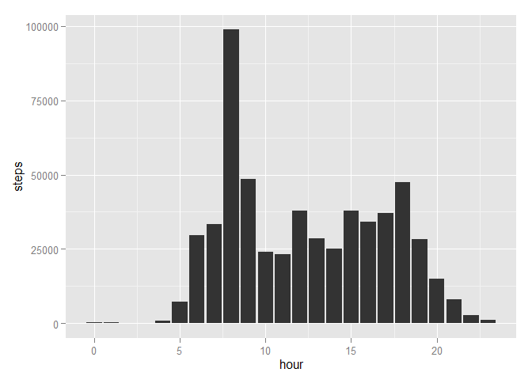

# Reproducible Research: Peer Assessment 1

## Loading neccessary libraries

```r
library(ggplot2)
```

## Loading and preprocessing the data

- **First read the raw data**
- **Then using "date" and "interval" to construct two new columns `time` and `hour`**


```r
stepData = read.csv(unz("activity.zip", "activity.csv"), header=T, na="NA",
                   colClasses=c("integer", "character", "integer"))
stepData$time = strptime(paste(stepData$date, paste(stepData$interval %/% 100, 
                        stepData$interval %% 100, sep=":")), "%Y-%m-%d %H:%M")
stepData$hour = stepData$time$hour
```

## What is mean total number of steps taken per day?
The mean steps taken per day is 9354.2


## What is the average daily activity pattern?


```r
g <- ggplot(data=stepData, aes(x=hour, y=steps))
g + geom_histogram(stat="identity")
```

```
## Warning: Removed 2304 rows containing missing values (position_stack).
```

 

## Imputing missing values


## Are there differences in activity patterns between weekdays and weekends?
